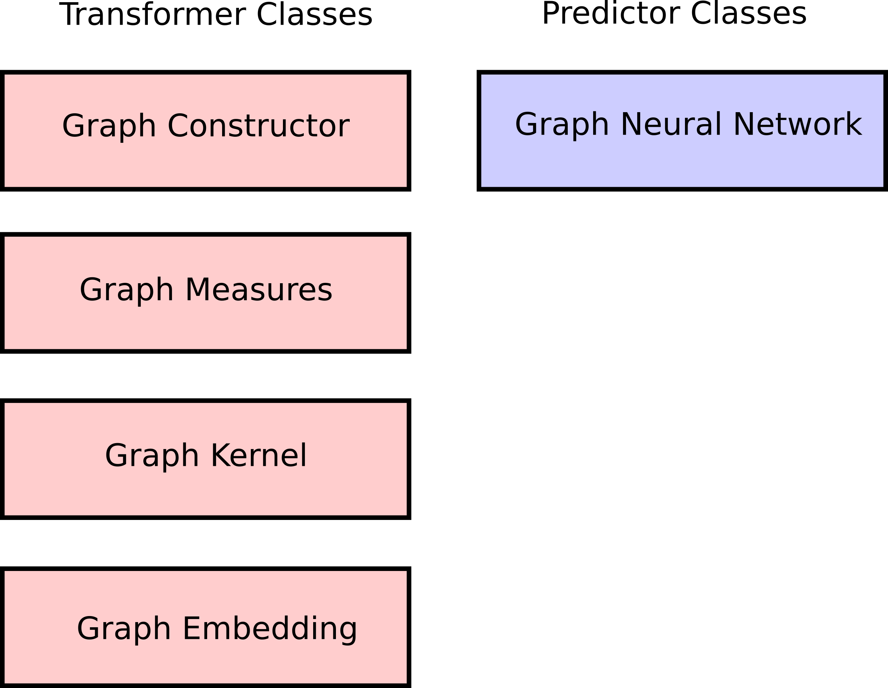

# API

The API of PHOTONAI Graph is based on the PHOTONAI package. It provides additional methods that can be used for graph machine learning, and a few utility functions for handling the conversions of graphs as well as writing and saving them. The different methods are implemented so that they can be used as elements of a photon pipeline or on their own, as all elements are also sklearn compatible as they implement fit/transform/predict functions. There is a certain workflow (link the workflow page) so that the graph machine learning steps work together. Each implemented method is either a transformer or a predictor as can be seen on the chart below.

