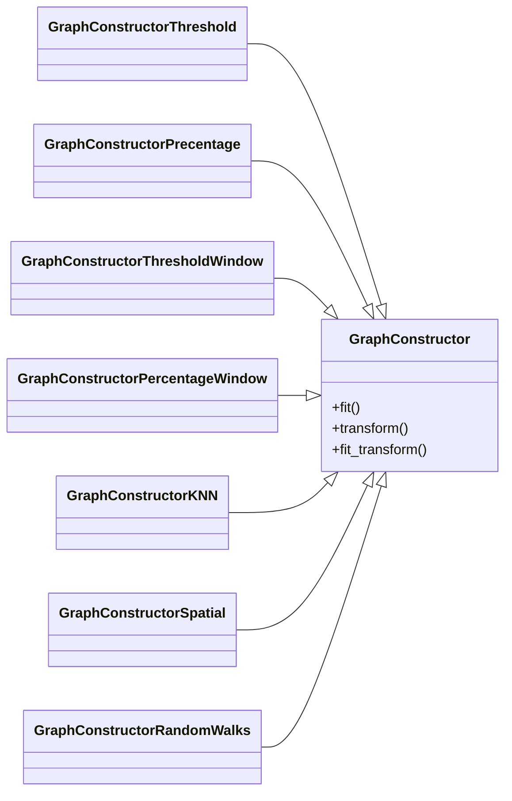

# Graph Construction

The Graph Construction module is a collection of transformer classes that construct adjacency matrices 
for graphs based on connectivity matrices. This includes well established methods like thresholding the 
connectivity matrix, but also allows for more complex adjacency matrix construction methods like kNN-based 
matrix construction. The adjacency matrices that the transform method of each class returns can then be 
converted into different formats like networkx, scipy sparse or dgl graphs.

Depending on the type of data you are working with, you might have very noisy data. 
Or you might be interested only in weaker connections. Or you want the same adjacency matrix for every graph. 
Transforming your connectivity matrix into an adjacency matrix of your choice can be achieved by the different 
graph constructor classes, which implement different transformations of the connectivity matrix. In the case of 
noisy data, thresholding the connections might reduce noise and increase computational speed, by having to evaluate 
less edges later on. Picking a threshold or percentage window allows you to discard other connections, focusing on 
the information that is contained in the connections that fall in your window range. And creating the same 
adjacency matrix for every graph, with only different node features might allow you to use graph algorithms you 
might otherwise not be able to use.

Hint: By clicking on the class in the above diagram you will find the according documentation.

## GraphConstructor
::: photonai_graph.GraphConstruction.GraphConstructor.__init__
    rendering:
        show_root_toc_entry: False

## GraphConstructorThreshold
::: photonai_graph.GraphConstruction.GraphConstructorThreshold.__init__
    rendering:
        show_root_toc_entry: False

## GraphConstructorPercentage
::: photonai_graph.GraphConstruction.GraphConstructorPercentage.__init__
    rendering:
        show_root_toc_entry: False

## GraphConstructorThresholdWindow
::: photonai_graph.GraphConstruction.GraphConstructorThresholdWindow.__init__
    rendering:
        show_root_toc_entry: False

## GraphConstructorPercentageWindow
::: photonai_graph.GraphConstruction.GraphConstructorPercentageWindow.__init__
    rendering:
        show_root_toc_entry: False

## GraphConstructorKNN
::: photonai_graph.GraphConstruction.GraphConstructorKNN.__init__
    rendering:
        show_root_toc_entry: False

## GraphConstructorSpatial
::: photonai_graph.GraphConstruction.GraphConstructorSpatial.__init__
    rendering:
        show_root_toc_entry: False

## GraphConstructorRandomWalks
::: photonai_graph.GraphConstruction.GraphConstructorRandomWalks.__init__
    rendering:
        show_root_toc_entry: False
