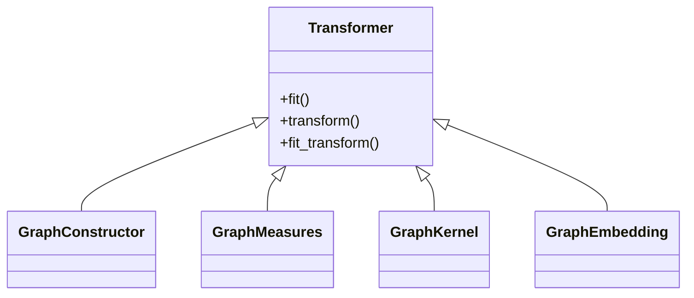
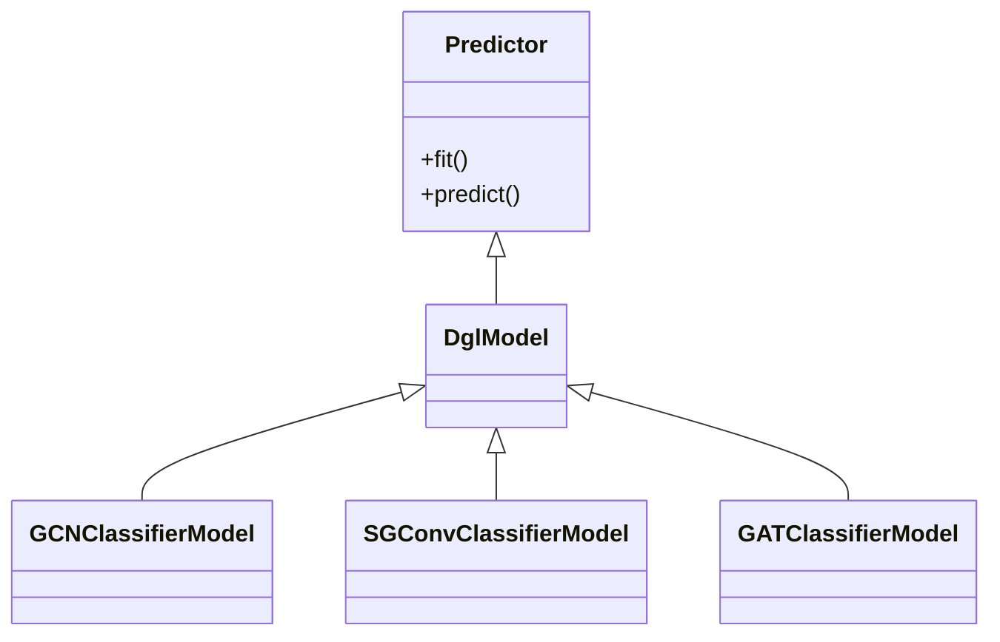
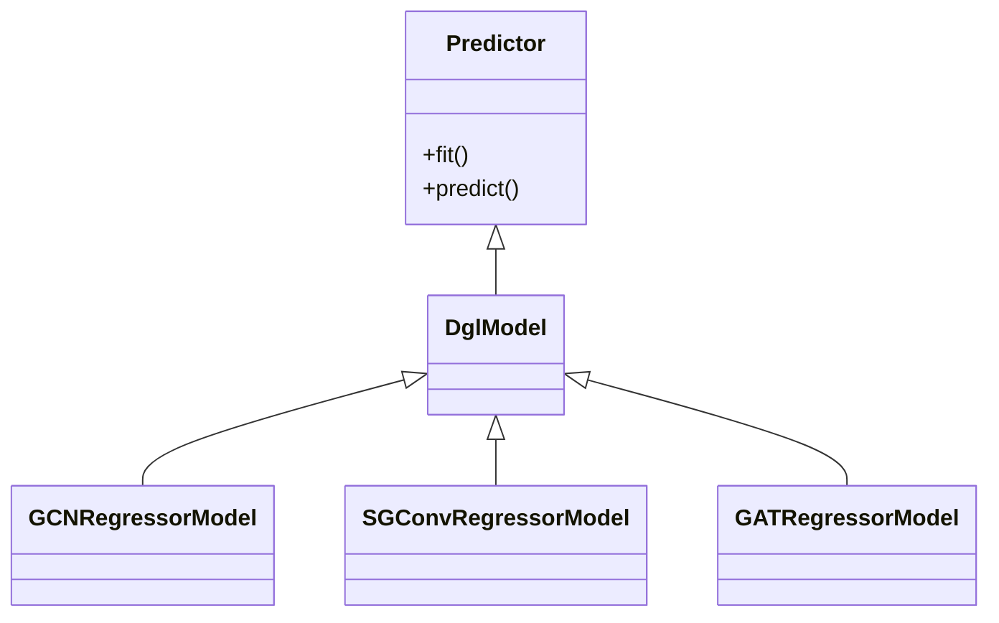

# API

The API of PHOTONAI Graph is based on the PHOTONAI package. 
It provides additional methods that can be used for graph machine learning, and a few utility functions for 
handling the conversions of graphs as well as writing and saving them. The different methods are implemented 
so that they can be used as elements of a photon pipeline or on their own, as all elements are also sklearn 
compatible as they implement fit/transform/predict functions. There is a certain [workflow](/workflow/)
so that the graph machine learning steps work together. Each implemented method is either a transformer or a
predictor.

## Transformer Classes
Transformer objects are performing transformations of the input data. Therefore each transformer has to provide
either a `fit()` and a `transform()` function or a `fit_transform()` function. 

## Predictor Classes
Predictor objects are the actual learning algorithm of the respective pipeline.
Therefore each predictor has to provide at least a `fit()` and a `predict()` function.

PHOTONAI Graph provides predefined models for classification and regression.

### Classification

### Regression
