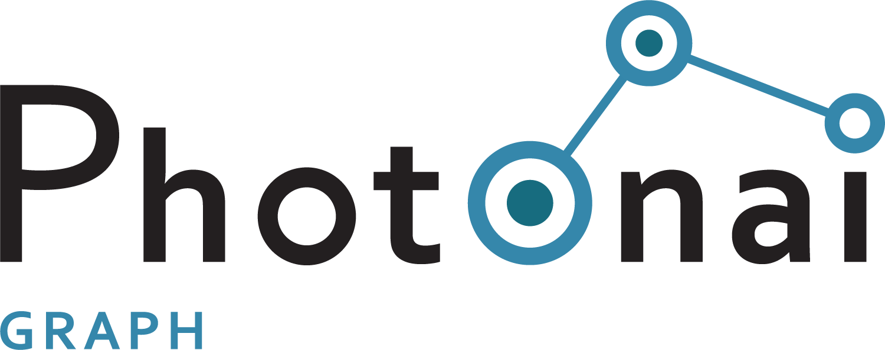
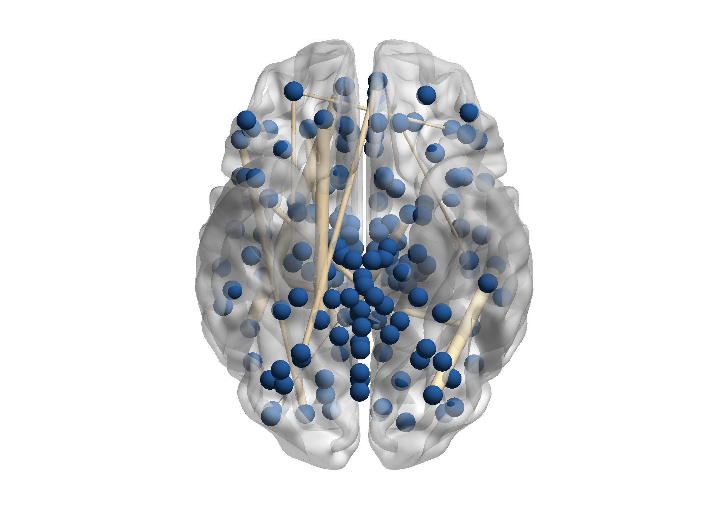

# PHOTONAI -Graph

This is an extension module to the PHOTONAI Python toolbox. With PHOTONAI Graph, you can create graph embeddings, calculate graph measures, train graph neural networks and use other graph machine learning methods.

## Background

Graphs structures can be found in many different fields from social networks, to molecular graphs to brain networks. 
They are very common in biology and neuroscience, for example in the area of connectomics. 

Graphs provide a natural
representation of networks and allow for the study of their properties. In order to make use of the special information
that the graph structure provides, different machine learning techniques have been developed. PHOTONAI Graph integrates
a lot of these algorithms into the PHOTON framework and makes out-of-the-box models available for the study of graphs.

This allows researchers from a variety of fields to use graph machine learning techniques for their projects and to 
build pipelines and evaluate them within a few lines of code.