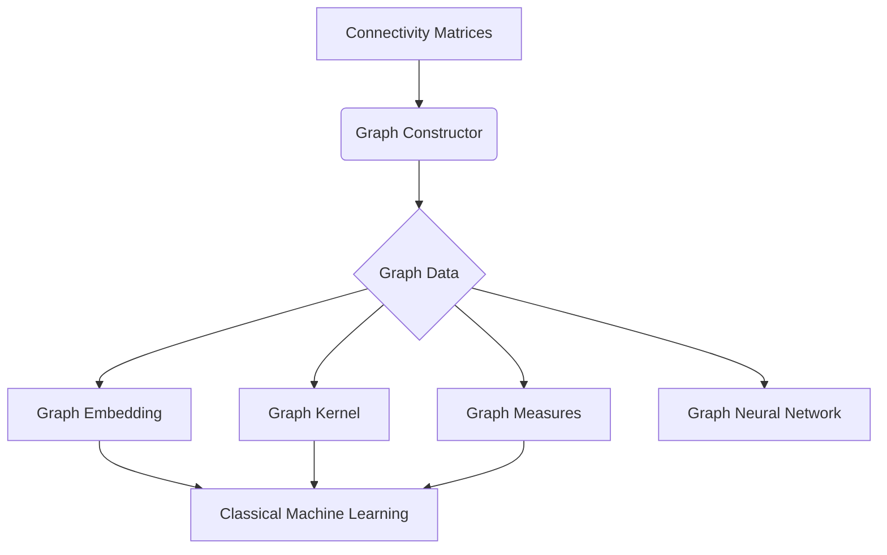

# Workflow

The starting point for PHOTON Graph can be either connectivity matrices or data that is already in a graph 
format. Depending on your starting point, there are different 
ways in which you will have set up your pipeline. In the case that you have connectivity matrices, 
you will need to use graph constructors to turn those connectivity matrices into adjacency matrices. 
After that you can choose from different options of doing machine learning with your graph data.



### Connectivity matrices

If you have connectivity matrices as your starting point, these might be noisy and densely connected, 
as for example in the case of resting state functional connectivity in the area of neuroscience. 
In order to reduce the amount connections and possibly reduce noise, one could threshold the graph so 
weak connections will be discarded. 

```python
import numpy as np
from photonai_graph.GraphConstruction import GraphConstructorThreshold

# Generate dummy data
example_graph = np.ones((20, 20, 20))
example_target = np.eye(20)

# Init GraphConstructorThreshold object
constructor = GraphConstructorThreshold(threshold=0.1)
constructor.fit(example_graph, example_target)

# Create graph from matrix
graph = constructor.transform(example_graph)
```

!!! info
    This is not the only possible way to construct adjacency matrices, 
    and many more methods have been implemented, which can be found in the [graph constructor section](api/graph_construction.md).

After transforming your matrix, using a graph constructor you can then use this matrix to do machine learning with it.

## PHOTONAI Graph internal datastructure
PHOTONAI Graph expects the graphs to be embedded in an 4 dimensional ndarray. Graph Constructors are 
automatically transforming your input data into the desired format. If you want to preprocess your data
in an external library and later use PHOTONAI Graph, you have to take care of the input by yourself.

The shape of the input has to be in this format:

$$
[100, 20, 20, 4]
$$

Here we have defined

* 100 Subjects
* 20 Nodes per subject (20x20 adjacency matrix)
* 4 Channels. The first channel is usually the adjacency (adjacency_axis), 
other channels might for example contain node or edge features

!!! danger "Sparse matrices"
    Currently there is no support for sparse input matrices.
    Dense matrices are suitable for many small graphs, as usually the case in neuroscience environments.
    Rule of thumb: If your data still fits in your computers memory as numpy dense array, you are able to use PHOTONAI Graph.

## Machine Learning on Graphs

Once you have a graph structure, you can then use this graph structure to do machine learning on it in a variety of ways.

!!! note
    Before running the analysis make sure if it should run using classical machine learning or deep learning with graph
    neural networks.

#### Classical Machine Learning
For classical Machine Learning approaches we have to extract features from the graphs.
PHOTONAI Graph offers different options for extracting features:

??? tip "[Graph Embeddings](api/graph_embeddings.md)"

    Graph Embeddings are a way to learn a low dimensional representation of a graph. 
    Through a graph embedding a graph can be represented in low dimensional form, while preserving graph
    information. This low-dimensional representation can then be used for training classic machine learning algorithms
    that would otherwise make no use of the graph information.
??? tip "[Graph Measures](api/graph_measures.md)"

    Graph measures or metrics are values that capture graph properties like efficiency. 
    As these measures capture information across the entire graph, or for nodes, edges or subgraphs, 
    they can be used to study graph properties. 
    These measures can also be used as a low-dimensional representation of the graph in machine learning tasks.
??? tip "[Graph Kernels](api/graph_kernels.md)"

    Graph Kernels are learnable functions that map the graph structure into a lower dimensional representation 
    and are commonly used to solve different problems in graph classification, or regression.

After the data is transformed into a feature representation a standard PHOTONAI pipeline can be used to 
predict on the graph data. For more details consult the <a href='https://wwu-mmll.github.io/photonai/' target='_blank'>PHOTONAI documentation</a>.

!!! note 
    All of the <a href='https://wwu-mmll.github.io/photonai/algorithms/estimators/' target='_blank'>PHOTONAI estimators</a>
    can be used directly with PHOTONAI Graph.

#### Deep Learning
In contrast, Graph Neural Nets are modified neural networks, that learn directly on graphs and make use of graph 
information. Here different architectures are available, and no transformation step is required prior to the network.

!!! warning
    If using Graph Neural Networks your data has to be in graph format. If you extract metadata from your graph
    using a PHOTONAI Graph transformer, the application of Graph Neural Networks is not possible.

PHOTONAI Graph already provides some [Graph Neural Networks](api/graph_convnets.md). However, additional models can
be added by [extending PHOTONAI Graph](extending_photonai_graph.md).

### Building a pipeline
When building a pipeline, the elements are highly dependent on your input data.
If the input data is a connectivity matrix this has to be transformed into a graph at first.
For illustrative purposes the example will consider the case where the input data is a connectivity matrix.

!!! info
    PHOTONAI Graph provides functions for generation of dummy connectivity matrices.

The next necessary decision is if the graph should be transformed into features for a subsequent classic
machine learning pipeline or directly fed into a deep learning model.

#### Example

```python
from photonai.base import Hyperpipe, PipelineElement
from photonai_graph.GraphUtilities import get_random_connectivity_data, get_random_labels
from sklearn.model_selection import KFold

# make random matrices to simulate connectivity matrices
X = get_random_connectivity_data(number_of_nodes=50, number_of_individuals=100)
y = get_random_labels(type="regression", number_of_labels=100)

# Design your Pipeline
my_pipe = Hyperpipe('basic_gembedding_pipe',
                    inner_cv=KFold(n_splits=5),
                    outer_cv=KFold(n_splits=3),
                    optimizer='sk_opt',
                    optimizer_params={'n_configurations': 25},
                    metrics=['mean_absolute_error'],
                    best_config_metric='mean_absolute_error')

my_pipe.add(PipelineElement('GraphConstructorThreshold',
                            hyperparameters={'threshold': 0.95}))

my_pipe.add(PipelineElement('GraphEmbeddingHOPE'))

my_pipe.add(PipelineElement('SVR'))

my_pipe.fit(X, y)
```

### Extended Notes

PHOTON Graph is written in such a way that each function is sklearn compatible. This means that every method can also used in custom pipelines outside of the PHOTON framework.
